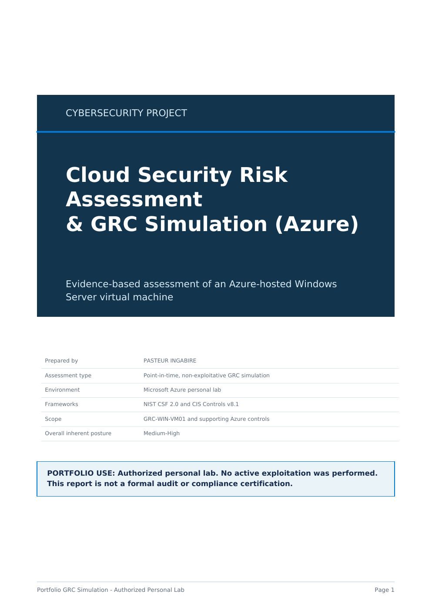
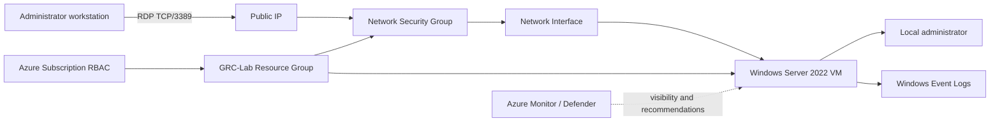
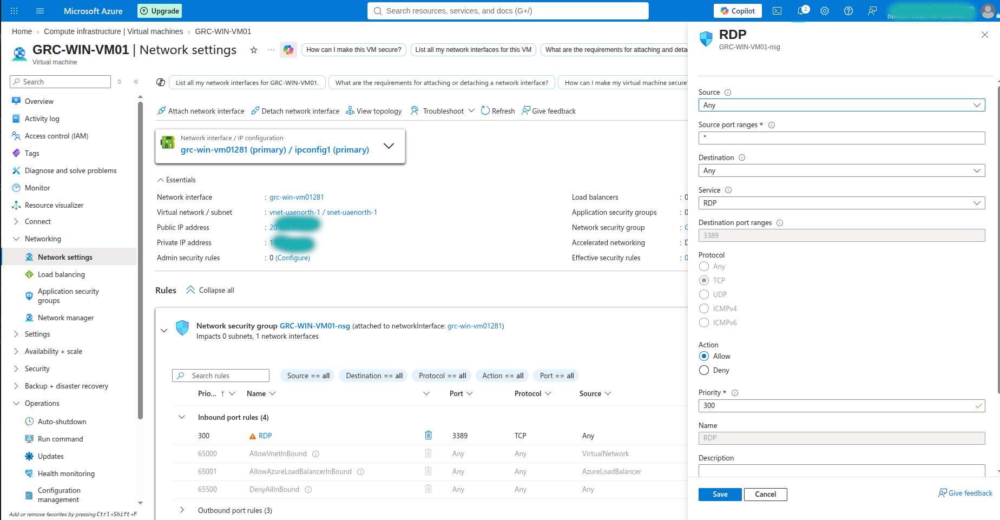
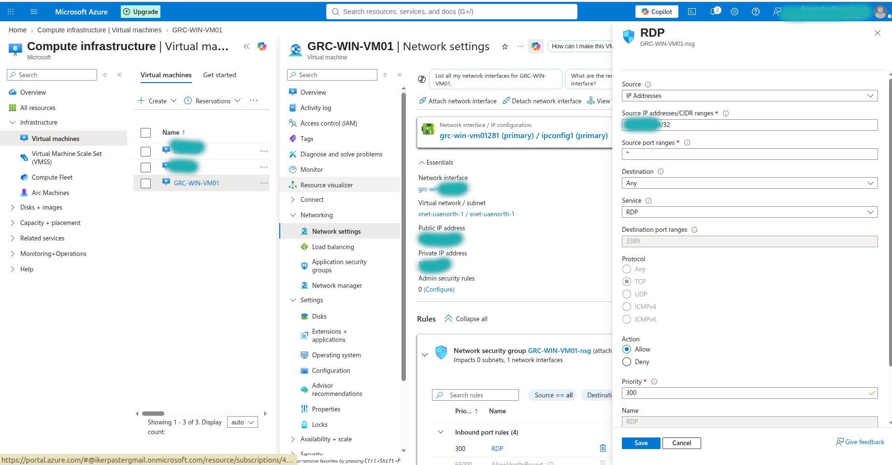
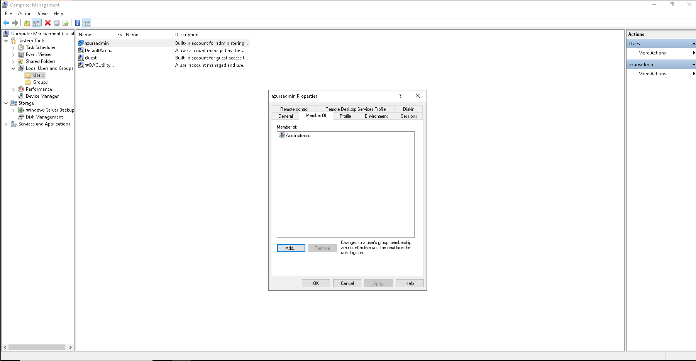

# Cybersecurity Project: Cloud Security Risk Assessment & GRC Simulation (Azure)


<p align="center">
  
</p>

## Executive snapshot

This project demonstrates a non-exploitative cloud security risk assessment of a Windows Server virtual machine hosted in Microsoft Azure. I evaluated infrastructure, identity, remote access, endpoint configuration, logging, and subscription-level privileges; scored risks using a likelihood x impact model; mapped safeguards to NIST CSF 2.0 and CIS Controls v8.1; and validated one priority mitigation.

| Assessment metric | Result |
|---|---:|
| Assets reviewed | 8 |
| Risks recorded | 5 |
| High risks | 4 |
| Medium risks | 1 |
| Highest inherent score | 16/25 |
| Mitigations implemented and validated | 1 |
| Overall inherent posture | Medium-High |

> **Key result:** RDP (TCP/3389) was initially allowed from `Any` source. The NSG rule was changed to a trusted public IPv4 `/32`, reducing the risk score from **16 (High)** to **8 (Medium)**. The remaining exposure should be further reduced with Azure Bastion, VPN/private access, or Just-in-Time access.

## Environment and scope

| Item | Assessed environment |
|---|---|
| Cloud provider | Microsoft Azure |
| Resource group | `GRC-Lab` |
| Virtual machine | `GRC-WIN-VM01` |
| Operating system | Windows Server 2022 Datacenter: Azure Edition |
| Region | UAE North |
| Remote access | Native RDP over TCP/3389 |
| Administrative identity | Local account `azureadmin` |
| Assessment approach | GRC-focused, evidence-based, non-exploitative |

**In scope:** the VM, NIC, public IP, NSG, local administrator identity, Windows security/update configuration, local event logs, Azure monitoring posture, Defender recommendations, and subscription RBAC relevant to the VM.

**Out of scope:** active exploitation, brute-force testing, vulnerability scanning, production workloads, business applications, data classification, and resources unrelated to `GRC-WIN-VM01`.



## Methodology

1. Defined the assessment scope and identified cloud, identity, access, endpoint, logging, and governance assets.
2. Collected screenshots from Azure Portal and the Windows guest without performing exploitation.
3. Connected realistic threats to observed weaknesses and documented business impact.
4. Scored each risk using `Likelihood x Impact` on a 1-5 scale.
5. Prioritized treatment and mapped safeguards to NIST CSF 2.0 and CIS Controls v8.1.
6. Restricted RDP to a trusted `/32` source and recorded before/after evidence.

### Rating model

| Score | Rating |
|---:|---|
| 1-4 | Low |
| 5-9 | Medium |
| 10-16 | High |
| 17-25 | Critical |

## Risk register summary

| ID | Risk scenario | L | I | Score | Rating | Treatment status |
|---|---|---:|---:|---:|---|---|
| R-01 | Publicly reachable RDP could enable password spraying or brute-force attempts | 4 | 4 | 16 | High | **Partially mitigated** - restricted to trusted `/32` |
| R-02 | Compromise of the local administrator credential could provide full VM control | 3 | 5 | 15 | High | Planned |
| R-03 | Disabled automatic updating and endpoint protection gaps could increase exploitation risk | 3 | 4 | 12 | High | Planned |
| R-04 | A single subscription Owner assignment creates privilege concentration and misuse risk | 2 | 5 | 10 | High | Accepted for lab; reduce in production |
| R-05 | Local logs exist, but Azure alerts and centralized guest monitoring were not configured | 3 | 3 | 9 | Medium | Planned |

Open the [browser-viewable risk register PDF](reports/risk-register-viewable.pdf), or download the [editable Excel risk register](reports/risk-register.xlsx). The full narrative is available in [reports/cloud-security-risk-assessment.pdf](reports/cloud-security-risk-assessment.pdf).

## Priority findings

### 1. Broad RDP exposure - High (16/25)

The baseline NSG rule allowed TCP/3389 from any source to a VM with a public IP. This creates a common entry path for automated credential attacks.

<table>
  <tr>
    <th>Before: Any source allowed</th>
    <th>After: trusted IPv4 /32</th>
  </tr>
  <tr>
    <td></td>
    <td></td>
  </tr>
</table>

**Implemented control:** changed the NSG source from `Any` to the administrator's trusted public IPv4 `/32`, while retaining source port `*`, destination TCP/3389, and Allow action.

### 2. Privileged local account - High (15/25)

The enabled `azureadmin` account is a member of the local Administrators group. The assessment did not establish that MFA protects this local RDP sign-in path. Credential compromise would therefore have high impact.



### 3. Endpoint and patch configuration gaps - High (12/25)

Windows Update reported no updates available at assessment time, but also indicated that automatic updates were turned off by organizational policy. Windows Security showed Tamper Protection disabled and potentially unwanted application blocking disabled. These are configuration weaknesses; they do **not** by themselves prove the VM was missing a specific security patch or actively compromised.

### 4. Subscription privilege concentration - High (10/25)

The assessment account held the Owner role at subscription scope. This is expected in a small personal lab, but a production environment should apply least privilege, separation of duties, access reviews, and limited administrative elevation.

### 5. Detection and monitoring gap - Medium (9/25)

Windows Security event logs were available locally, but Azure Monitor alerts were not configured and enhanced guest monitoring was not enabled. This can delay detection, triage, and response.

## Control mapping

| Risk | Recommended safeguard | Type | NIST CSF 2.0 | CIS Controls v8.1 |
|---|---|---|---|---|
| R-01 | Restrict administrative ingress; prefer Bastion, VPN, private access, or JIT | Preventive | PR.PS, PR.AA | 4.4, 12.2 |
| R-02 | Require MFA for administrative access and centralize authentication where supported | Preventive | PR.AA | 6.4, 6.5, 6.7 |
| R-03 | Maintain secure endpoint configuration and automated OS patching | Preventive / Corrective | PR.PS | 4.1, 7.3 |
| R-04 | Enforce least privilege, RBAC, separation of duties, and recurring access reviews | Preventive / Governance | GV.RR, PR.AA | 5.1, 6.8 |
| R-05 | Centralize guest logs and configure actionable alerts | Detective | DE.CM, DE.AE | 8.2, 8.11 |

Mappings express control intent and are not a certification or compliance attestation. See [docs/control-mapping.md](docs/control-mapping.md) for rationale.

## Mitigation roadmap

| Priority | Action | Success measure |
|---|---|---|
| P0 - Complete | Restrict NSG RDP source to trusted IPv4 `/32` | No `Any` source on TCP/3389; authorized RDP test succeeds |
| P0 | Replace direct public RDP with Azure Bastion, VPN/private access, or JIT | No continuously exposed public administrative port |
| P0 | Protect administrative access with MFA-capable centralized authentication | Administrative sign-in requires MFA where supported |
| P1 | Enable Azure Monitor Agent, Log Analytics collection, and alert rules | Guest security events searchable centrally; alerts reach an action group |
| P1 | Enable automatic patch orchestration and verify compliance | VM reports compliant patch status on the defined schedule |
| P1 | Enable endpoint protections currently shown as disabled | Security dashboard contains no corresponding warning state |
| P2 | Replace standing Owner access with least-privilege roles and access reviews | No unnecessary permanent Owner assignment; reviews documented |

## Repository contents

```text
azure-cloud-grc-risk-assessment/
├── README.md
├── SECURITY.md
├── docs/
│   ├── control-mapping.md
│   ├── evidence-index.md
│   ├── linkedin-post.md
│   ├── mitigation-plan.md
│   └── risk-assessment-report.md
├── evidence/
│   └── 00-14 assessment screenshots
└── reports/
    ├── cloud-security-risk-assessment.pdf
    ├── report-cover.png
    ├── risk-register-viewable.pdf
    └── risk-register.xlsx
```

## Skills demonstrated

- Azure VM, NSG, public IP, monitoring, Defender for Cloud, and RBAC review
- Asset, threat, vulnerability, likelihood, and impact analysis
- Risk register development and treatment prioritization
- NIST CSF 2.0 and CIS Controls v8.1 mapping
- Technical-to-business risk communication
- Evidence handling, privacy redaction, and mitigation validation
- Executive reporting for audit and GRC stakeholders

## Ethics and limitations

This personal lab assessment was authorized and non-destructive. No passwords, IP addresses, tenant IDs, subscription IDs, or other authentication secrets are intentionally published. Screenshots are point-in-time evidence and do not constitute a penetration test, formal audit, compliance certification, or assurance opinion.

## References

- [NIST Cybersecurity Framework 2.0](https://www.nist.gov/publications/nist-cybersecurity-framework-csf-20)
- [CIS Critical Security Controls v8.1](https://www.cisecurity.org/controls/v8-1)
- [Azure network security groups overview](https://learn.microsoft.com/en-us/azure/virtual-network/network-security-groups-overview)
- [Azure Monitor for virtual machines](https://learn.microsoft.com/en-us/azure/azure-monitor/vm/vminsights-overview)
- [Azure role-based access control overview](https://learn.microsoft.com/en-us/azure/role-based-access-control/overview)

## Author

**PASTEUR INGABIRE** - Cybersecurity and cloud security portfolio project.
